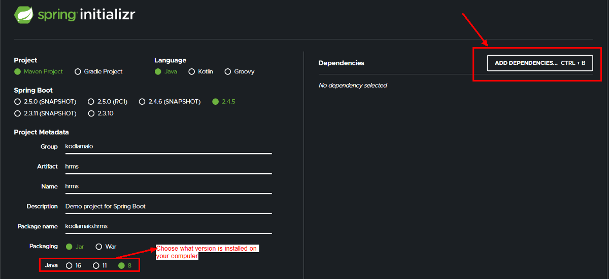
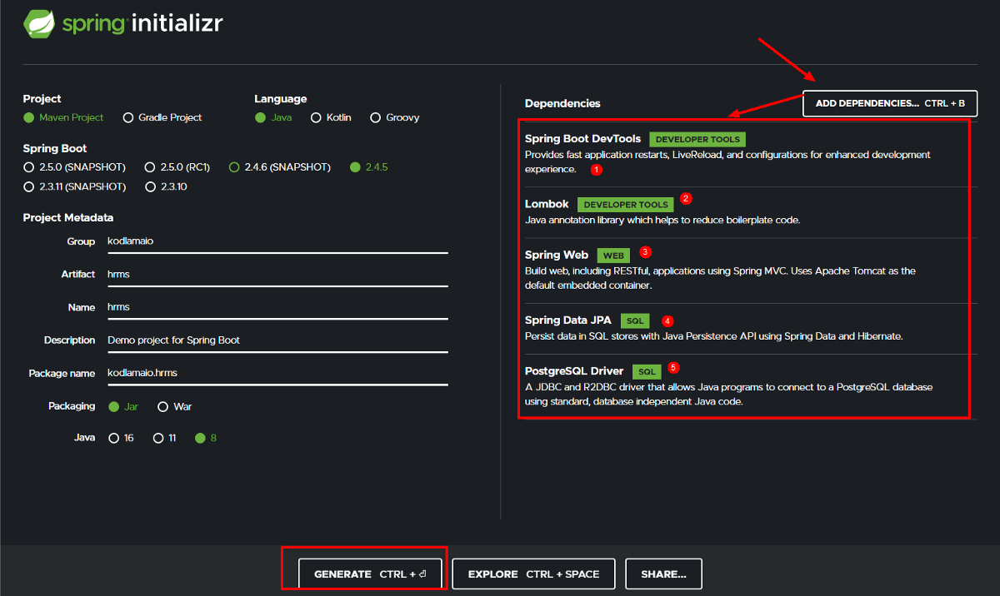
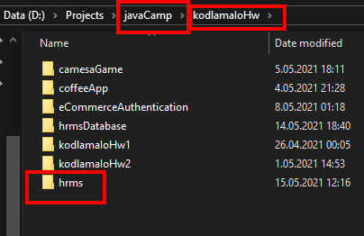
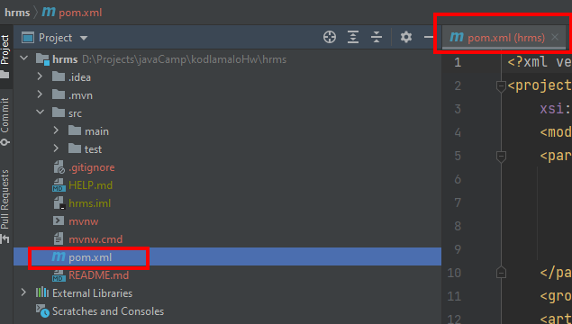
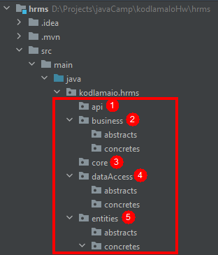
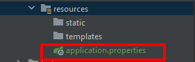

 # **HRMS (Human Resource Management System)** 

 - I wanted to summarize the project step by step from the beginning to the end. I hope that will be useful.

  ## Let's do the **Spring** setup first

 - Go to the [**Spring initializr**](https://start.spring.io/)
   
     - 
   
     - 

 - Extract and paste the downloaded file into the folder you are working on.
   
    - 
    
 - Maven comes automatically with **Intellij Idea**. (**For eclipse : file ->import -> Existing Maven**). Also add layers. 

    - 
      
    - 
    
  ## Postgre integration

 - Add the [**postgreconfig.txt**](https://github.com/engindemirog/Northwind-Database-Script-for-Postgre-Sql/blob/master/postgreconfig.txt) file under **resources**.

    - 
   
 -  Run main class and go to **localhost:8080/...**
 -  **Thats all !** 🤞

 